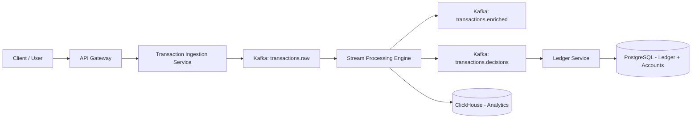
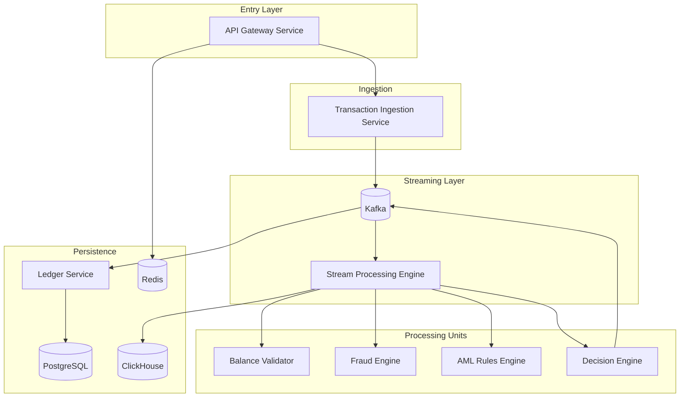
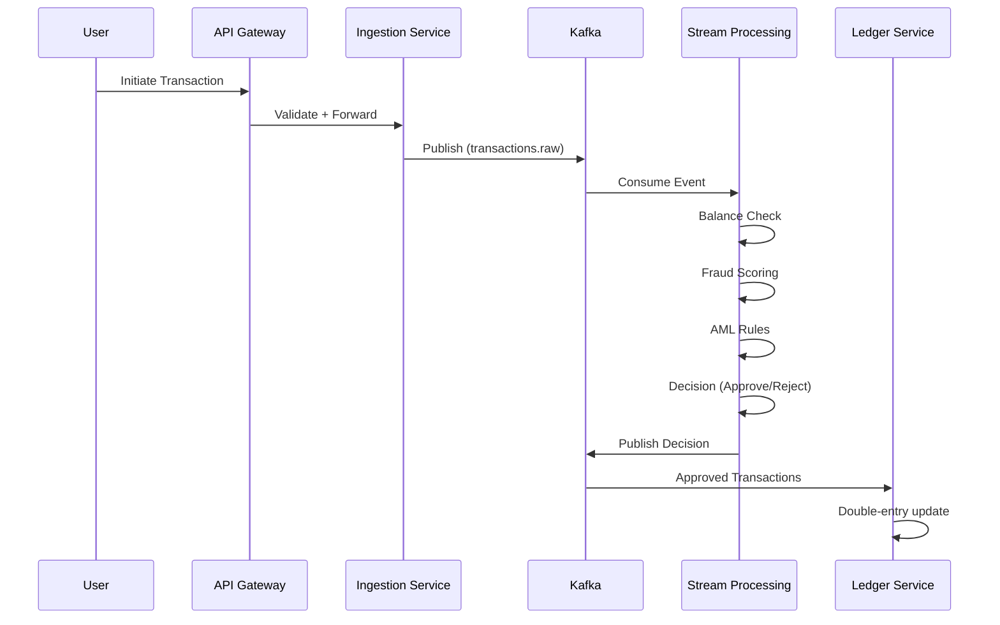

# EventForge  
## Real-Time Distributed Financial Transaction Monitoring & Fraud Detection Platform

---

## Overview

EventForge is a distributed, event-driven system that simulates a fintech-grade payment processor.

It is designed to model how real financial systems handle:

- High-throughput transaction processing  
- Real-time fraud detection  
- Strict accounting guarantees  
- Failure recovery and replay  

This is not a CRUD-based backend.  
The system is built to explore distributed systems concepts under realistic constraints.

---

## Project Goals

- Build a real-time transaction processing pipeline  
- Implement fraud detection using rule-based scoring  
- Maintain financial consistency using a double-entry ledger  
- Design for fault tolerance and replayability  
- Understand distributed systems trade-offs  

---

## Core Architecture

EventForge follows:

- Event-Driven Architecture (EDA)  
- Event Sourcing  
- CQRS (Command Query Responsibility Segregation)  
- Stateful Stream Processing  
- Idempotent Transaction Handling  
- Exactly-once processing (design goal, not fully implemented yet)  

---

## High-Level Architecture

---

## Detailed Architecture

---

## Core Services

### 1. API Gateway Service

Built with FastAPI.

Responsibilities:

- Authentication (JWT)  
- Idempotency key handling  
- Request validation  

Endpoints:

- POST /auth/login  
- POST /transactions  
- GET /transactions/{id}  
- GET /accounts/{id}  

---

### 2. Transaction Ingestion Service

Responsibilities:

- Business rule validation  
- Transaction ID generation  
- Metadata enrichment (IP, geo, device)  
- Publish events to Kafka  

Topic:

- transactions.raw  

---

### 3. Stream Processing Engine

Technology:

- Faust (or equivalent)

Consumes:

- transactions.raw

Processing Units:

- Balance Validator  
- Fraud Scoring Engine  
- AML Rule Engine  
- Decision Engine  

Outputs:

- transactions.enriched  
- transactions.decisions  

---

### 4. Ledger Service

Responsibilities:

- Consume approved transactions  
- Perform double-entry accounting  
- Persist data to PostgreSQL  
- Ensure financial consistency  

Invariant:

Sum(Debits) = Sum(Credits)

---

### 5. Analytics Engine

Technology:

- ClickHouse

Responsibilities:

- Store enriched and aggregated data  
- Fraud rate analysis  
- Transaction volume tracking  
- Regional insights  
- Real-time dashboards  

---

## Kafka Topics

- transactions.raw  
- transactions.enriched  
- transactions.decisions  
- ledger.entries  
- alerts.fraud  

Partitioning Strategy:

- Partitioned by from_account_id  

---

## Transaction Flow

---

## Fraud Detection (Rule-Based)

Features:

- Transaction velocity (short time window)  
- Amount anomaly  
- Geo-location change  
- Device change  

Risk Score:

risk_score = w1 * (amount / avg_amount)
           + w2 * velocity
           + w3 * geo_change
           + w4 * device_change

Thresholds:

- 0.85 → REVIEW  
- 0.95 → BLOCK  

---

## Storage Systems

### PostgreSQL

- Users  
- Accounts  
- Ledger  
- Final transaction state  

### Redis

- Session store  
- Rate limiting  
- Cached balances  

### ClickHouse

- Analytical queries  
- Aggregations  
- Fraud metrics  

### Kafka

- Event backbone  
- Replay capability  
- Decoupled communication  

---

## Failure Handling Strategy

- Dead-letter topics  
- Idempotent producers  
- Retry with exponential backoff  
- Consumer offset management  
- Out-of-order event handling  
- Event replay  

---

## Current Status

Work in progress.

Current focus:

- Kafka setup  
- Basic ingestion pipeline  
- Event flow between services  

Next steps:

- Stream processing logic  
- Ledger implementation  
- Idempotency handling  
- Fraud scoring integration  

---

## Engineering Focus

This project is designed to explore:

- Distributed system design  
- Data consistency in financial systems  
- Event-driven architectures  
- Failure handling and recovery  
- Real-time stream processing  

---

## Future Extensions

- ML-based fraud detection  
- Graph-based AML detection  
- Multi-currency support  
- Cross-border routing  
- Chaos testing  
- Scaling benchmarks  
